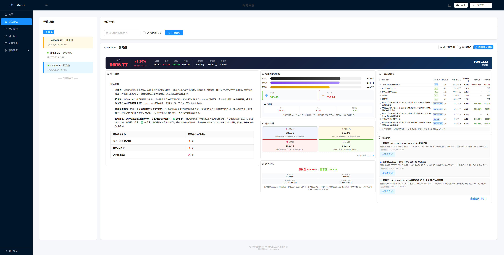
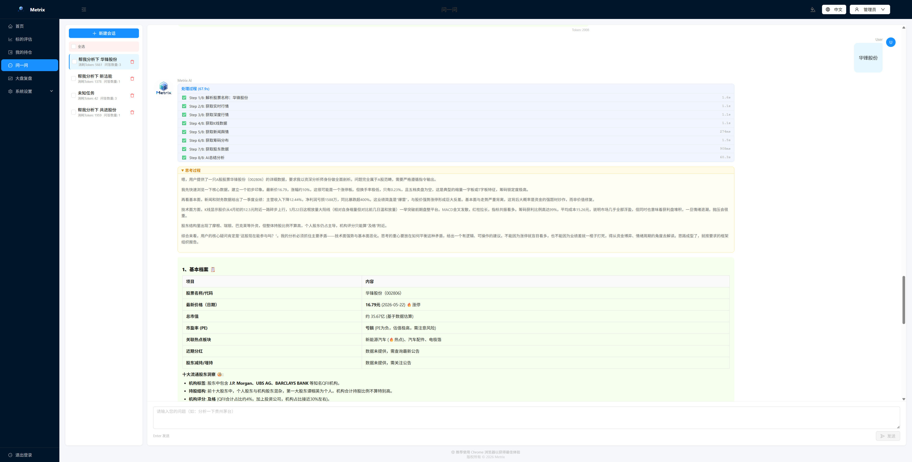

# Metrix

> [English](./README_en.md) | 中文

Metrix = Metric（指标） + Matrix（矩阵）

一个基于量化交易视角的资产评估工具。

## Web界面概览

<p align="center">AI 多维度分析页面</p>


<p align="center">AI 每日市场复盘页面</p>


<p align="center">多轮对话式 AI 分析页面</p>


## 技术栈

| 层级 | 技术                                              |
|------|-------------------------------------------------|
| 后端 | Java 21, Spring Boot 4.0.5, MyBatis-Plus 3.5.15 |
| 数据库 | PostgreSQL 16                                   |
| AI | LangChain4j 0.36.2 (OpenAI / Ollama)            |
| 认证 | Sa-Token 1.45.0 (JWT, 注解鉴权)                  |
| 前端 | Vue 3, Ant Design Vue, Vite                     |
| 数据源 | TickFlow (行情), 博查 (新闻), AKshare (基础数据)          |
| 工具 | Hutool 5.8.13, Flexmark, Lombok                 |

## 功能特性

- **AI 智能分析** — 集成大模型对股票进行多维度分析（技术面、资金面、消息面）
- **AI 问一问** — 支持多轮对话式分析，实时追踪 8 步处理过程的耗时与状态，Markdown 流式渲染
- **主题切换** — 内置 5 种主题色（天空蓝/翡翠绿/暮光紫/落日橙/极光青），基于 Ant Design Vue Design Token 全局生效
- **实时行情** — 通过 TickFlow 获取实时报价、深度数据、K 线数据
- **新闻聚合** — 通过博查 API 获取相关股票新闻并自动摘要
- **筹码分析** — Python 脚本计算筹码分布与成本集中度
- **PDF 导出** — 将分析报告导出为 PDF 文件
- **大盘复盘** — 对每日 A 股主要指数进行 AI 复盘分析，生成市场总结与趋势研判
- **持仓管理** — 多账户持仓管理，支持批量录入、一键评估、实时盈亏监控
- **飞书通知** — 分析完成后通过飞书 Webhook 推送结果
- **多模型支持** — 支持 OpenAI 兼容接口和 Ollama 本地模型
- **国际化** — 支持中文和英文界面
- **权限管理** — 基于 RBAC 的权限系统，支持角色/菜单/接口三级权限控制，接口粒度的注解鉴权，动态菜单展示

## 快速开始

### 环境要求

- JDK 21
- Maven 3.9+
- Node.js 18+
- PostgreSQL 16
- Python 3.10+（可选，用于筹码分析）

### 本地开发

```bash
# 1. 配置数据库
cp .env.example .env
# 编辑 .env 填入 PostgreSQL 连接信息

# 2. 初始化数据库
psql -h 127.0.0.1 -U postgres -d stock_analysis -f .doc/db/ddl-init.sql
psql -h 127.0.0.1 -U postgres -d stock_analysis -f .doc/db/dml-init.sql

# 3. 启动后端
mvn clean package -DskipTests
java -jar target/stock-analysis-1.0.0.jar

# 4. 启动前端（新终端）
cd frontend
npm install
npm run dev
```

前端默认运行在 `http://localhost:5173`，后端 API 在 `http://localhost:8080`。

### Docker 部署

```bash
# 构建并启动所有服务（后端 + 前端 + 数据库）
docker compose up -d --build

# 初始化数据库（首次部署）
docker compose exec -T postgres psql -U postgres -d stock_analysis < .doc/db/ddl-init.sql
docker compose exec -T postgres psql -U postgres -d stock_analysis < .doc/db/dml-init.sql

# 查看日志
docker compose logs -f app
```

访问 `http://localhost` 使用系统。

> **架构说明**：生产环境中，Nginx 容器提供前端静态资源（Vue SPA），同时将 `/api` 请求反向代理到 Java 后端，无需单独配置跨域。

### 前端单独部署（非 Docker）

```bash
cd frontend

# 安装依赖
npm install

# 构建生产包
npm run build

# 方式一：使用 nginx 部署（推荐）
# 将 dist/ 目录拷贝到 nginx 的 html 目录下，并配置 nginx.conf 代理 /api 到后端

# 方式二：使用 Vite 预览（仅开发/测试）
npm run preview
```

前端默认运行在 `http://localhost:4173`（preview）或 nginx 配置的端口，后端 API 需可访问。

## 项目结构

```
Metrix/
├── src/main/java/com/bintech/metrix/
│   ├── controller/        # REST 控制器
│   │   └── admin/         # 管理后台控制器
│   ├── service/           # 业务逻辑层
│   ├── repository/        # 持久层（Entity + Mapper）
│   ├── dto/               # 数据传输对象
│   ├── enums/             # 枚举
│   ├── config/            # 配置类（含 Sa-Token 鉴权）
│   ├── constants/         # 常量定义
│   └── exception/         # 全局异常处理
├── frontend/              # Vue 3 前端
│   └── src/
│       ├── views/         # 页面组件
│       │   └── admin/     # 管理后台页面
│       ├── api/           # API 客户端
│       ├── router/        # 路由
│       ├── composables/   # Vue 组合式函数（主题、状态管理等）
│       └── i18n/          # 国际化
├── python-service/        # Python 辅助服务
└── .doc/
    ├── db/                # 数据库脚本（DDL+DML+种子数据）
    │   ├── ddl-init.sql   # 完整建表脚本
    │   ├── dml-init.sql   # 初始数据（角色、管理员用户）
    │   └── system_api.sql # 接口注册数据
    └── images/            # 图片资源
```

## 配置说明

系统通过环境变量配置，支持 `.env` 文件：

| 变量 | 默认值 | 说明 |
|------|--------|------|
| `POSTGRES_URL` | `jdbc:postgresql://127.0.0.1:5432/stock_analysis` | 数据库连接地址 |
| `POSTGRES_USERNAME` | `postgres` | 数据库用户名 |
| `POSTGRES_PASSWORD` | `postgres` | 数据库密码 |

### AI 模型配置

通过前端配置页可管理 AI 模型：
- **OpenAI 兼容**：填写 API Base URL、API Key、模型名称
- **Ollama**：填写 Ollama 服务地址和模型名称

### 数据源配置

- **TickFlow**：实时行情数据，需配置 API Key
- **博查**：新闻数据，需配置 API Key
- **Tushare**：股票基础数据，导入 CSV 文件

> **注意**：Windows 下使用 AKShare 时如遇网络代理错误，系统会自动清除子进程的 `HTTP_PROXY`/`HTTPS_PROXY` 环境变量，确保直连外网。

## API 概览

所有 API 以 `/api` 为前缀，部分接口需要登录认证（Sa-Token JWT）。共 100+ 个 API 端点，完整列表见 `.doc/db/system_api.sql`。

### 业务接口

| 端点 | 说明 |
|------|------|
| `POST /api/auth/login` | 用户登录 |
| `POST /api/auth/login-by-code` | 微信扫码登录 |
| `GET  /api/auth/permissions` | 获取当前用户权限列表 |
| `POST /api/analysis` | 提交分析任务 |
| `GET  /api/analysis` | 分析记录列表 |
| `GET  /api/analysis/{id}/detail` | 分析报告详情 |
| `GET  /api/analysis/{id}/pdf` | 导出 PDF |
| `POST /api/market-review/trigger` | 发起大盘复盘 |
| `GET  /api/market-review` | 复盘记录列表 |
| `POST /api/chat/session` | 创建对话会话 |
| `GET  /api/chat/sessions` | 会话列表 |
| `POST /api/chat/send` | 发送消息（SSE 流式响应） |
| `GET  /api/portfolio/holdings` | 持仓列表 |
| `POST /api/portfolio/holdings/batch` | 批量新增持仓 |
| `GET  /api/stock-basic/page` | 标的数据（分页） |
| `GET  /api/stocks/search` | 标的搜索 |

### 管理接口

| 端点 | 说明 | 权限 |
|------|------|------|
| `GET  /api/admin/users` | 用户列表 | `system:user:list` |
| `PUT  /api/admin/users/{id}/freeze` | 冻结用户 | `system:user:freeze` |
| `GET  /api/admin/roles` | 角色列表 | `system:role:list` |
| `POST /api/admin/roles/{id}/menus` | 分配菜单权限 | `system:role:assign-menu` |
| `POST /api/admin/roles/{id}/apis` | 分配接口权限 | `system:role:assign-api` |
| `GET  /api/admin/menus/tree` | 菜单树 | `system:menu:list` |
| `POST /api/admin/menus` | 创建菜单 | `system:menu:create` |
| `GET  /api/admin/apis` | 接口列表 | `system:api:list` |
| `GET  /api/admin/usage-stats/today` | 今日统计 | `system:stats:today` |
| `GET  /api/admin/audit-logs` | 审计日志 | `system:audit:view` |

## 开发指南

- 遵循 MyBatis-Plus 条件构造器方式进行数据库操作，禁止手写 SQL
- 实体类继承 `BaseEntity`，使用 Lombok 注解
- 控制器只做参数校验和请求转发，业务逻辑在 Service 层
- 使用构造函数注入，禁止 `@Autowired`
- 数据库变更脚本统一放在 `.doc/db/` 下


## 许可证

MIT License | Copyright © 2026 bin.li
