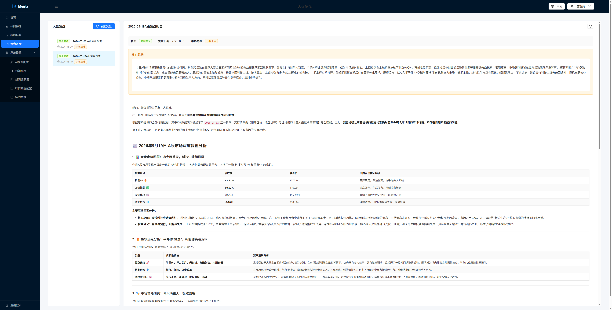

# # Metrix

> English | [中文](./README.md)

Metrix = Metric + Matrix - an asset evaluation tool based on the perspective of quantitative trading.

## Web preview




## Tech Stack

| Layer | Technology                                                   |
|-------|--------------------------------------------------------------|
| Backend | Java 21, Spring Boot 4.0.5, MyBatis-Plus 3.5.15              |
| Database | PostgreSQL 16                                                |
| AI | LangChain4j 0.36.2 (OpenAI / Ollama)                         |
| Auth | Sa-Token 1.36.0 (JWT)                                        |
| Frontend | Vue 3, Ant Design Vue, Vite                                  |
| Data Sources | TickFlow (market data), Bocha (news), AKshare (fundamentals) |
| Utilities | Hutool 5.8.13, Flexmark, Lombok                              |

## Features

- **AI Analysis** — Multi-dimensional stock analysis powered by LLMs (technical analysis, capital flow, news sentiment)
- **Real-time Market Data** — Real-time quotes, depth data, and K-line data via TickFlow
- **News Aggregation** — Stock-related news via Bocha API with auto-summarization
- **Chip Distribution** — Python-based shareholding cost distribution analysis
- **PDF Export** — Export analysis reports as PDF
- **Feishu Notifications** — Push analysis results via Feishu Webhook
- **Multi-Model Support** — OpenAI-compatible APIs and local Ollama models
- **i18n** — Chinese and English UI

## Quick Start

### Prerequisites

- JDK 21
- Maven 3.9+
- Node.js 18+
- PostgreSQL 16
- Python 3.10+ (optional, for chip analysis)

### Local Development

```bash
# 1. Configure database
cp .env.example .env
# Edit .env with your PostgreSQL connection info

# 2. Initialize database
psql -h 127.0.0.1 -U postgres -d stock_analysis -f .doc/db/V1.0.0_init.sql

# 3. Start backend
mvn clean package -DskipTests
java -jar target/stock-analysis-1.0.0.jar

# 4. Start frontend (new terminal)
cd frontend
npm install
npm run dev
```

Frontend runs at `http://localhost:5173`, backend API at `http://localhost:8080`.

### Docker Deployment

```bash
# Build and start all services (backend + frontend + database)
docker compose up -d --build

# Initialize database (first deployment only)
docker compose exec -T postgres psql -U postgres -d stock_analysis < .doc/db/V1.0.0_init.sql

# View logs
docker compose logs -f app
```

Access `http://localhost` to use the system.

> **Architecture note**: In production, Nginx serves the Vue SPA static files and reverse-proxies `/api` requests to the Java backend, eliminating the need for CORS configuration.

### Frontend Standalone Deployment (non-Docker)

```bash
cd frontend

# Install dependencies
npm install

# Build for production
npm run build

# Option 1: Deploy with nginx (recommended)
# Copy dist/ to nginx html directory and configure nginx.conf to proxy /api to backend

# Option 2: Vite preview (dev/test only)
npm run preview
```

Frontend runs at `http://localhost:4173` (preview) or your nginx-configured port. The backend API must be reachable.

## Project Structure

```
stock-analysis/
├── src/main/java/com/bin/stockanalysis/
│   ├── controller/        # REST controllers
│   ├── service/           # Business logic layer
│   ├── repository/        # Persistence layer (Entity + Mapper)
│   ├── core/              # Core engine (analysis, task queue)
│   ├── dto/               # Data transfer objects
│   ├── enums/             # Enumerations
│   ├── config/            # Configuration classes
│   ├── exception/         # Global exception handler
│   └── util/              # Utility classes
├── frontend/              # Vue 3 frontend
│   └── src/
│       ├── views/         # Page components
│       ├── api/           # API client
│       ├── router/        # Router configuration
│       └── i18n/          # Internationalization
├── python-service/        # Python sidecar services
│   ├── tickflow.py        # Real-time market data fetcher
│   └── akshare.py         # Chip distribution calculator
└── .doc/
    ├── db/                # Database migration scripts
    └── basic/             # Fundamental data files
```

## Configuration

System configuration via environment variables (supports `.env` file):

| Variable | Default | Description |
|----------|---------|-------------|
| `POSTGRES_URL` | `jdbc:postgresql://127.0.0.1:5432/stock_analysis` | Database JDBC URL |
| `POSTGRES_USERNAME` | `postgres` | Database username |
| `POSTGRES_PASSWORD` | `postgres` | Database password |

### AI Model Configuration

Manage AI models through the frontend config page:
- **OpenAI-compatible**: API Base URL, API Key, model name
- **Ollama**: Service URL and model name

### Data Source Configuration

- **TickFlow**: Real-time market data, requires API Key
- **Bocha**: News data, requires API Key
- **Tushare**: Stock fundamentals, import via CSV

## API Overview

All APIs are prefixed with `/api`. Some endpoints require authentication (Sa-Token JWT).

| Endpoint | Description |
|----------|-------------|
| `POST /api/auth/login` | User login |
| `GET  /api/stock/basic/list` | Stock list (paginated) |
| `GET  /api/stock/search` | Stock search |
| `POST /api/stock/analysis` | Submit analysis task |
| `GET  /api/stock/analysis/result` | Get analysis result |
| `GET  /api/stock/analysis/detail` | Analysis detail |
| `GET  /api/stock/analysis/export/pdf` | Export PDF |
| `GET  /api/stock/analysis/queue/status` | Queue status |
| `PUT  /api/config/ai-model` | Update AI model config |
| `PUT  /api/config/market-data` | Update market data source config |
| `PUT  /api/config/news-source` | Update news source config |
| `PUT  /api/config/notification` | Update notification config |

## Development Guide

- Use MyBatis-Plus `LambdaQueryWrapper` / `LambdaUpdateWrapper` for DB operations, no raw SQL
- Entity classes must extend `BaseEntity` with Lombok annotations
- Controllers handle only request validation and delegation
- Use constructor injection, never `@Autowired`
- Database migration scripts go in `.doc/db/`

## License

MIT License | Copyright © 2026 bin.li
